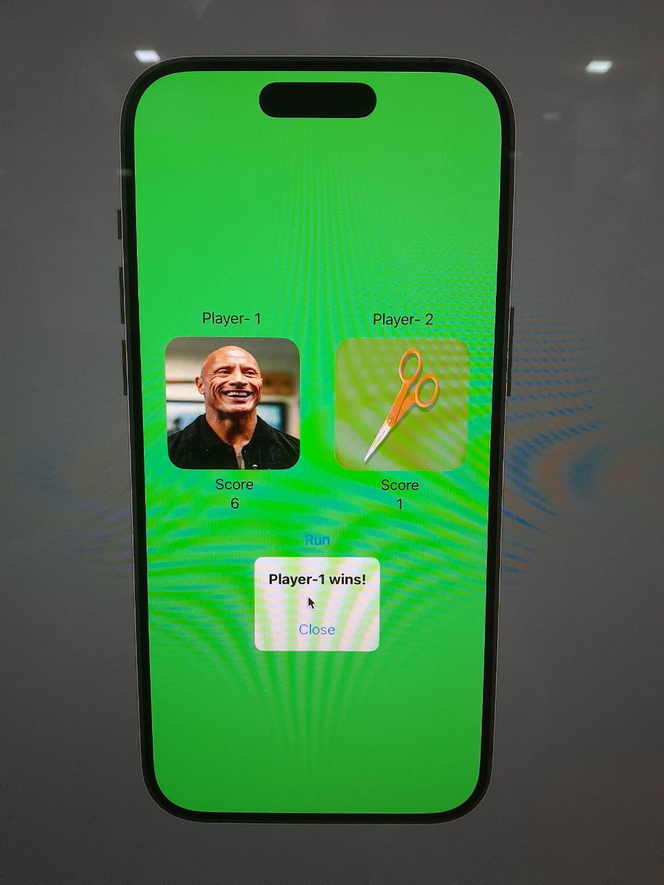

# Rock-Paper-Scissors iOS Game 

##### Roll No. 2007046

## Description

This is a simple **Rock-Paper-Scissors** game for iOS devices. It allows two players to compete by selecting random images representing their moves. The app calculates scores for both players and announces the winner when the game ends.

---

## Features

- **Two Players:** Player 1 and Player 2 can compete head-to-head.
- **Dynamic Score Tracking:** Scores are displayed under each player and updated in real-time.
- **Randomized Moves:** Players get random selections like rock, paper, scissors, or other images.
- **Winner Announcement:** Displays a popup announcing the winner when the score limit is reached.

---

## How to Play

1. Press the **Run** button to generate moves for both players.
2. The app compares the moves (e.g., scissors vs. paper) and updates scores based on the winner of the round.
3. When a player reaches the winning score, a popup announces the winner.
4. Press **Close** to reset or exit the game.

---

## Technologies Used

- **iOS Development:** Built using Swift and Xcode.
- **UIKit:** For designing the user interface.

---

## Future Improvements

- Add more themes and move options.
- Include animations for enhanced user experience.
- Implement multiplayer functionality via the internet or Bluetooth.

---

## Screenshots

1. **Game in Progress**  
   - Players' moves are displayed along with updated scores.

    
2. **Winner Announcement**  
   - A popup declares the winning player.

     

Enjoy playing! 🎮
